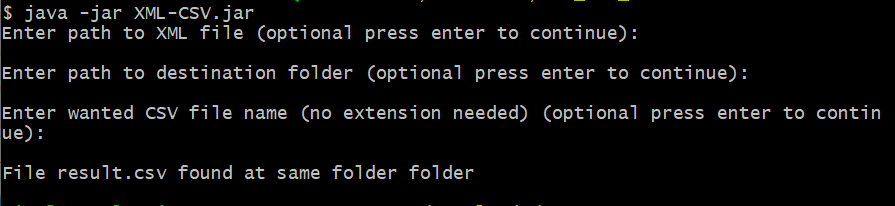

# XML to CSV
Converts standart Finvoice XML file to CSV file.

### Table of contents
- [XML to CSV](#xml-to-csv)
    - [Table of contents](#table-of-contents)
  - [About](#about)
  - [Install](#install)
  - [Usage](#usage)
      - [Snippet of command line.](#snippet-of-command-line)
  - [Missing features](#missing-features)
## About
Application is part of technical test for Accountor Finago.

The application converts Finvoice XML files to CSV file. 

Application is build using Java 15.

## Install
Make sure that you have latest version of Java installed. Application is build using Java 15.

Download JAR file from [here](./out/artifacts/XML_CSV_jar/XML-CSV.jar) and follow information at [usage](#usage).

OR

- Clone this [repository](https://github.com/veliValentine/XML-CSV-converter.git)
- Open up IDE
- Run the application using your IDE

## Usage
Application is an command line application and should be started using following steps.

1. Download [JAR](./out/artifacts/XML_CSV_jar/XML-CSV.jar)
2. Download [example-XML](./documents/exampleInvoice.xml)
3. Open command line
4. Navigate to the directory that contains the JAR and XML file
5. run command ```java -jar XML-CSV.jar```

After running the application four things are going to happen.

1. Application asks for the XML file. If no file is entered, the application assumes that there is a XML file in the same folder with the JAR file. Assumed XML file is named ```exampleInvoice.xml```
2. You can choose the destination folder for the output CSV. Otherwise it will be stored to the same folder as the JAR file
3. It asks the wanted name for the CSV file. If a blank name is given it will default to ```result.csv```. **Name is required if destination folder is given.**
4. It converts wanted XML file to CSV file

#### Snippet of command line.


## Missing features
1. Testing. For quick demo testing wasn't priority.
2. Application should test that the XML contains Finvoice tag with supported versions.
3. Application should test that XML file has contents
4. Encoding of the CSV file doesn't match.

The example [file](./documents/exampleInvoice.xml) works.

Author [veliValentine](https://github.com/veliValentine/)